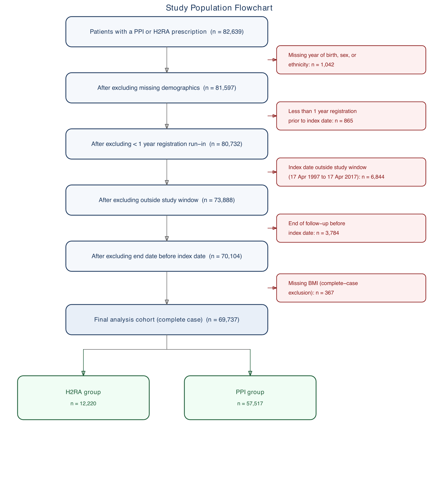
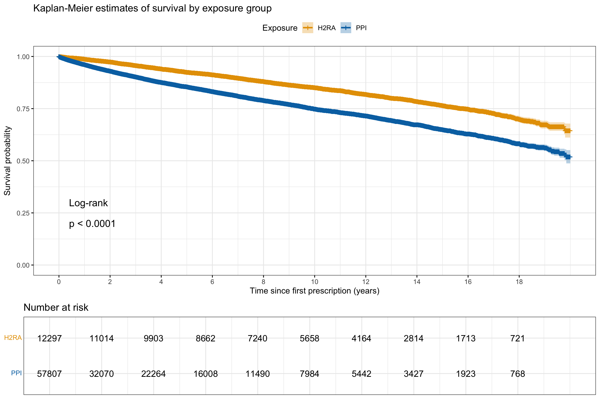
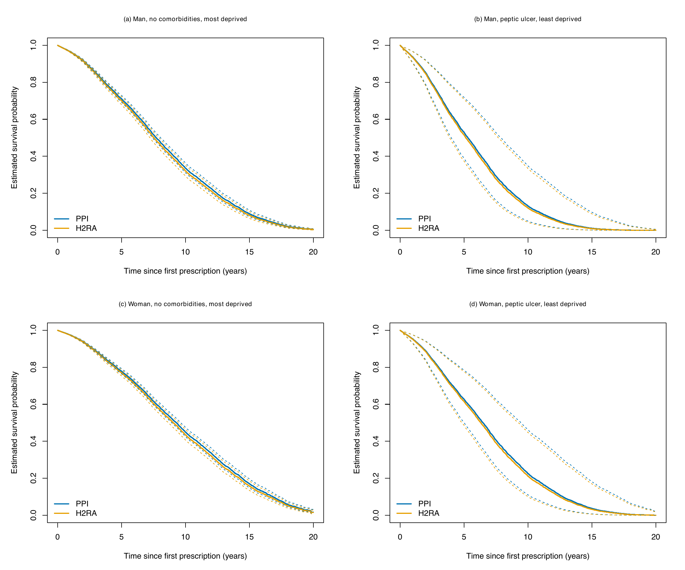
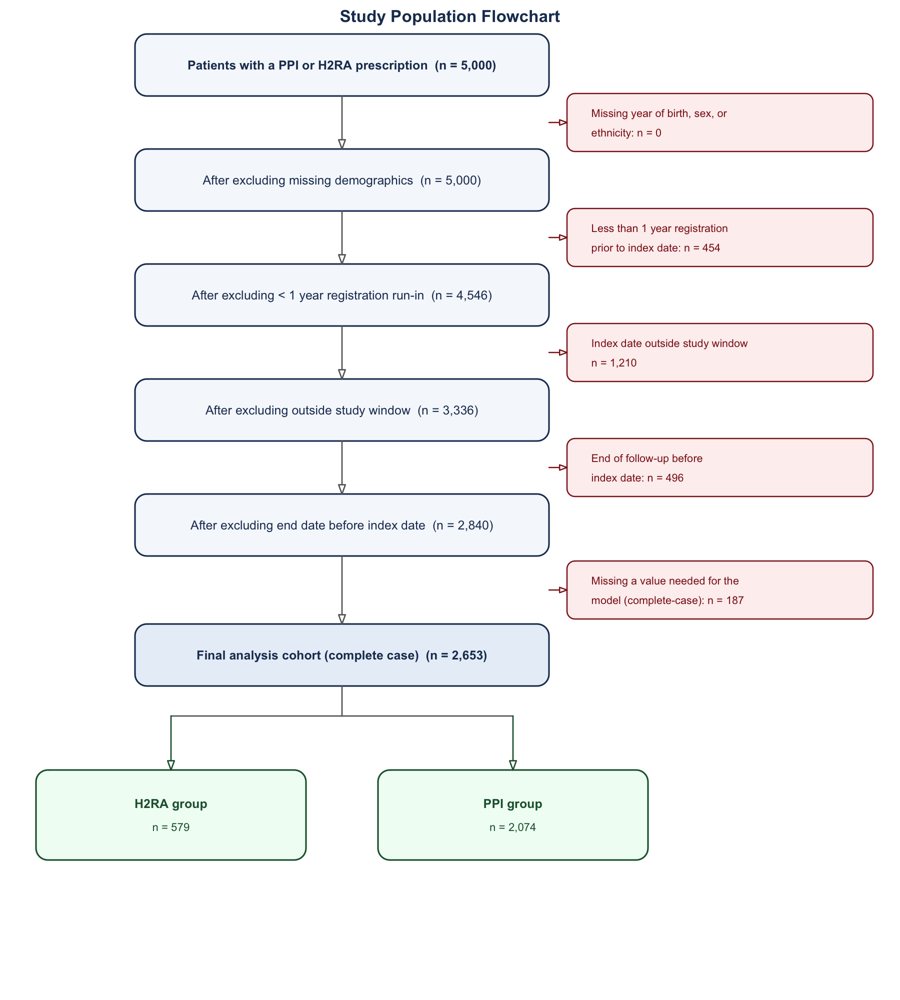
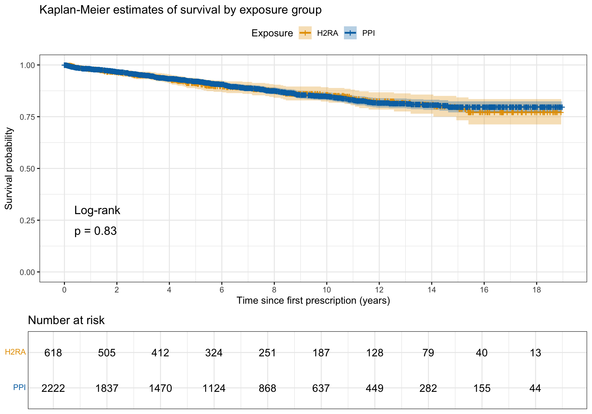
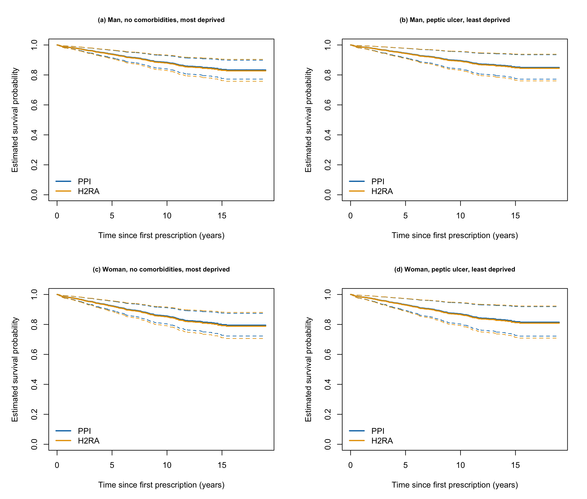

# EHR Cohort Analysis Pipeline

A Cox regression pipeline for a cohort study on electronic health record data, testing whether a prescription for a proton pump inhibitor (PPI) affects all-cause mortality, compared against a histamine H2-receptor antagonist (H2RA). The crude hazard ratio is 1.74. After adjustment for confounders, it's 0.96. The rest of this file covers the methods used in this analysis, the assumptions relied on, and the study limitations.

The findings below are from the original analysis, run on a simulated primary-care dataset. That dataset isn't included in this repo, for privacy reasons, so the scripts here run against a synthetic dataset instead, generated by `00_generate_synthetic_data.R`. The [demonstration section](#demonstration-on-synthetic-data) covers what that produces.

## Methods

The exposure is a patient's first prescription for a PPI or an H2RA, which sets the index date. Follow-up runs from the index date to death, leaving the practice, or the end of the study period (whichever comes first). Eligibility requires a recorded year of birth, sex, and ethnicity, at least a year of registration before the index date, and an index date inside the study window.

Confounders derived from the raw records: age at index date, sex, ethnicity, deprivation quintile, calendar period of the index date, BMI, prior gastric cancer, GERD in the six months before the index date, peptic ulcer in the same window, and the number of healthcare contacts in the year before the index date.

Age and healthcare-contact count are checked for functional form before entering the model. A model is fitted without each variable, its Martingale residuals are plotted against the variable, and both enter the model as natural cubic splines rather than a single linear term.

A univariable and a multivariable Cox model are fitted for PPI vs H2RA. The proportional-hazards assumption, that a covariate's hazard ratio stays constant over follow-up time, is checked two ways: `cox.zph()` on Schoenfeld residuals for every covariate, and a log(-log survival) plot for the exposure specifically, where roughly parallel curves support the assumption. A violation confined to a confounder is handled by stratifying the baseline hazard on that variable, so the exposure hazard ratio can still be estimated directly without assuming that confounder's effect is constant over time. In this analysis that meant stratifying on calendar period:

``` r
cox_final <- coxph(
  Surv(fup_years, died) ~
    ppi + ns(age, df = 3) + gender + ethnicity + ses_person + bmi +
    strata(calendarperiod) + prior_gastric_cancer + recent_gerd +
    recent_peptic_ulcer + ns(n_contacts, df = 3),
  data = analysis_cc,
  ties = "efron"
)
```

Survivor curves are predicted for four patient profiles, crossing sex with a comorbidity/deprivation contrast, under both exposures, to see how the fitted hazard ratio translates into absolute survival at different baseline risk.

## Findings

### Cohort

The eligible cohort is 70,104 patients: 57,807 on a PPI, 12,297 on an H2RA. The model runs on the 69,737 with complete data for every covariate.



### Crude vs. adjusted effect

9,775 died over follow-up, 13.4% of the PPI group and 16.3% of H2RA. The two groups have very different amounts of follow-up available: a median of 2.54 years for PPI against 9.35 years for H2RA. This tracks calendar period. PPI prescribing is concentrated in 2010–2017, H2RA mostly in 1997–2009, so H2RA patients have simply had more years in the database for an event to occur.



Survival is worse for PPI in the unadjusted comparison (log-rank p \< 0.0001), with a crude hazard ratio of 1.74 (95% CI 1.66–1.83). The adjusted hazard ratio, from the multivariable model, is 0.96 (95% CI 0.91–1.01, p = 0.12).

| Model         | HR (95% CI)      | p-value |
|---------------|------------------|---------|
| Univariable   | 1.74 (1.66–1.83) | \<0.001 |
| Multivariable | 0.96 (0.91–1.01) | 0.12    |

Several other covariates in the multivariable model have a clear effect: male sex (HR 1.36, 1.31–1.42), the most deprived SES quintile against the least (HR 1.40, 1.32–1.49), and calendar period, where the most recent band (2015–2017) has a hazard ratio of 5.17 (4.68–5.70) against the earliest. Age enters as a spline rather than a single coefficient, so it doesn't reduce to one number, but higher age is associated with substantially higher mortality across the range. Recent peptic ulcer (HR 2.61) and recent GERD (HR 0.49, in the opposite direction) both reach significance, but each is based on well under 200 patients in the whole cohort, which is covered under [Limitations](#limitations).

### Proportional-hazards check

The size of the calendar-period effect is also why it turns up in the proportional-hazards check. `cox.zph()` on the multivariable model returns a significant global test (chi-squared 385, 22 df, p \< 0.001), driven mainly by age and calendar period, with a smaller violation for healthcare-contact count. The exposure has no significant violation on its own (p = 0.08), and the log-log plot for PPI vs H2RA runs close to parallel across most of follow-up, consistent with that. Calendar period is the one stratified out of the final model, since it's both the largest confounder and the clearest violation tied to the exposure comparison. After stratifying, the PPI hazard ratio is 0.96 (95% CI 0.91–1.01, p = 0.16) with no PH violation for the exposure (p = 0.56), though age's violation is not addressed by this and remains in the final model.

### Predicted survival by profile



Comorbidity and deprivation, not drug choice, drive the visible differences in absolute survival across the four predicted survivor curves. A 60-year-old man with a recent peptic ulcer has a much steeper predicted decline than one with no recorded comorbidities, regardless of exposure. Within every one of the four profiles, the PPI and H2RA lines sit almost on top of each other, which is the same finding as the adjusted hazard ratio, shown a different way.

### Limitations {#limitations}

The proportional-hazards assumption fails overall for this model (global p \< 0.001). Only the calendar-period violation is addressed, by stratification. Age's violation is not, so the model's fit is not fully proportional-hazards compliant, even though the reported exposure hazard ratio satisfies the assumption once stratified.

Recent GERD and recent peptic ulcer are recorded in under 200 patients combined, out of over 70,000. Their hazard ratios are based on very few events and shouldn't be read as precise.

PPI and H2RA patients are compared across different eras of prescribing, not just different drugs. Stratifying by calendar period corrects the hazard-ratio estimate for this, but it does not make the two groups comparable in every other respect that changed over the same twenty years.

This is an active-comparator design, not a randomised one. Patients weren't assigned to PPI or H2RA at random, and reasons for that choice which weren't recorded in the data could still confound the result.

BMI is missing for 367 of the 70,104 eligible patients, who are dropped under complete-case analysis. If missingness relates to health status, this could shift the estimate in either direction.

## Demonstration on synthetic data {#demonstration-on-synthetic-data}

The synthetic dataset has 5,000 patients. 2,840 meet the eligibility criteria in `01_data_extraction.R`, and 2,653 have every value the Cox model needs.



325 died over follow-up: 11.3% of the PPI group, 11.8% of H2RA. The log-rank test returns p = 0.83, no difference between the two curves, which matches data built with no effect in it.



| Model                                | HR (95% CI)      | p-value |
|--------------------------------------|------------------|---------|
| Univariable                          | 0.97 (0.74–1.27) | 0.833   |
| Multivariable                        | 0.97 (0.74–1.27) | 0.809   |
| Final, stratified by calendar period | 0.96 (0.73–1.27) | 0.797   |

Concordance for the final model is 0.56, close to the 0.5 a model with no real predictive signal should land on. PPI and H2RA track closely across all four predicted survivor-curve profiles too, for the same reason.



`results/` also contains the Martingale residual plots, the Schoenfeld residual plots, the log-log check, and the full baseline characteristics table, all regenerated by a run.

## Running it

``` r
install.packages(c("tidyverse", "survival", "survminer", "broom"))
# splines ships with base R, no separate install needed
```

``` r
source("scripts/00_generate_synthetic_data.R")
source("scripts/01_data_extraction.R")
source("scripts/02_descriptive_analysis.R")
source("scripts/03_cox_regression.R")
```

`data/` is created locally and gitignored. `results/` is committed, from the run described above, and is overwritten by a fresh run. `results/original-analysis/` is static and isn't touched by any script here.

## License

MIT, see [LICENSE](LICENSE).
